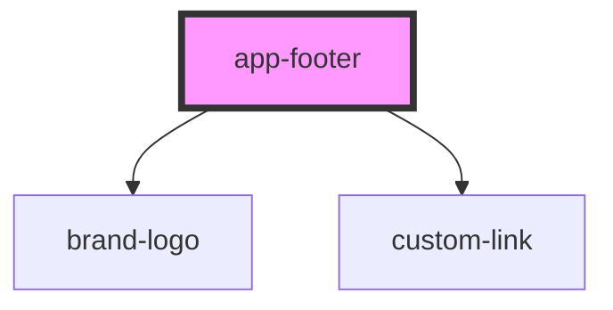

# app-footer

<!-- Auto Generated Below -->

## Overview

AppFooter Component

Main application footer with branding, navigation links, contact information, and social media integration.

Features:
- Two-section layout: top (branding and links) and bottom (contact and social media)
- Displays company full-slogan logo
- Phone number with call-to-action
- Multiple footer link sections
- Social media icon links
- Company disclaimer and copyright information

## Properties

| Property                   | Attribute      | Description            | Type           | Default     |
| -------------------------- | -------------- | ---------------------- | -------------- | ----------- |
| `companyName` _(required)_ | `company-name` | Company name           | `string`       | `undefined` |
| `links` _(required)_       | --             | Footer links           | `FooterLink[]` | `undefined` |
| `phone` _(required)_       | `phone`        | Phone number for quote | `string`       | `undefined` |
| `socialLinks` _(required)_ | --             | Social media links     | `SocialLink[]` | `undefined` |

## Dependencies

### Depends on

- [brand-logo](../brand-logo)
- [custom-link](../custom-link)

### Graph

----------------------------------------------

*Built with [StencilJS](https://stenciljs.com/)*
