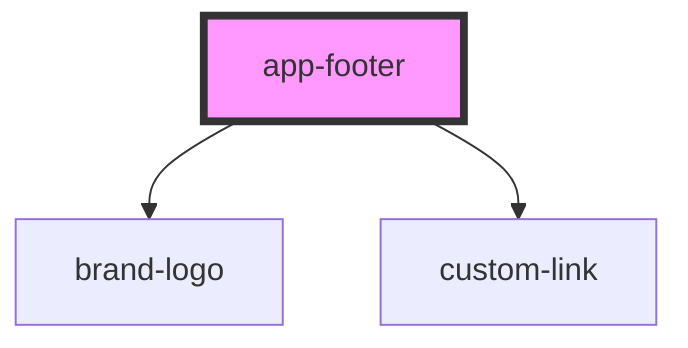

# app-footer

<!-- Auto Generated Below -->

## Properties

| Property      | Attribute      | Description            | Type           | Default        |
| ------------- | -------------- | ---------------------- | -------------- | -------------- |
| `companyName` | `company-name` | Company name           | `string`       | `COMPANY_NAME` |
| `links`       | --             | Footer links           | `FooterLink[]` | `FOOTER_LINKS` |
| `phone`       | `phone`        | Phone number for quote | `string`       | `FOOTER_PHONE` |
| `socialLinks` | --             | Social media links     | `SocialLink[]` | `SOCIAL_LINKS` |

## Dependencies

### Depends on

- [brand-logo](../brand-logo)
- [custom-link](../custom-link)

### Graph

----------------------------------------------

*Built with [StencilJS](https://stenciljs.com/)*
