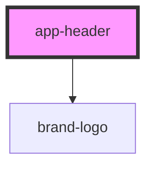

# app-header

<!-- Auto Generated Below -->

## Overview

AppHeader Component

Main application header with navigation controls, branding, and user interaction elements.

Features:
- Menu toggle button that opens the side drawer
- Brand logo display
- Search button that opens the search modal
- Phone number link
- Login link with icon

## Properties

| Property    | Attribute    | Description       | Type     | Default     |
| ----------- | ------------ | ----------------- | -------- | ----------- |
| `brandName` | `brand-name` | Company name/logo | `string` | `undefined` |
| `phone`     | `phone`      | Phone number      | `string` | `undefined` |

## Dependencies

### Depends on

- [brand-logo](../brand-logo)

### Graph

----------------------------------------------

*Built with [StencilJS](https://stenciljs.com/)*
