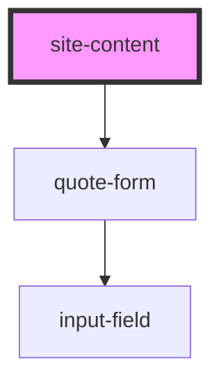

# site-content

<!-- Auto Generated Below -->

## Overview

Site Content wrapper, extracted from index.html <main>.
Note: Custom element tags require a hyphen by spec. The tag used is
`site-content` while the component folder is named `content` per request.

## Dependencies

### Depends on

- [quote-form](../quote-form)

### Graph

----------------------------------------------

*Built with [StencilJS](https://stenciljs.com/)*
