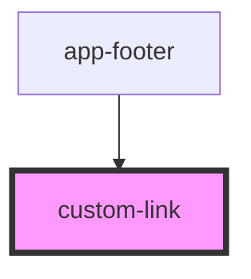

# custom-link

<!-- Auto Generated Below -->

## Properties

| Property             | Attribute | Description                                              | Type                              | Default        |
| -------------------- | --------- | -------------------------------------------------------- | --------------------------------- | -------------- |
| `href` _(required)_  | `href`    | Link URL                                                 | `string`                          | `undefined`    |
| `label` _(required)_ | `label`   | Link text                                                | `string`                          | `undefined`    |
| `variant`            | `variant` | Style variant: 'footer-top' (default) or 'footer-bottom' | `"footer-bottom" \| "footer-top"` | `'footer-top'` |

## Dependencies

### Used by

 - [app-footer](../app-footer)

### Graph

----------------------------------------------

*Built with [StencilJS](https://stenciljs.com/)*
