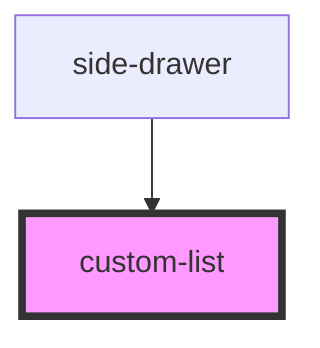

# custom-list

<!-- Auto Generated Below -->

## Overview

CustomList Component

A custom list component

## Properties

| Property     | Attribute | Description                      | Type                                                                             | Default     |
| ------------ | --------- | -------------------------------- | -------------------------------------------------------------------------------- | ----------- |
| `listBlocks` | --        | List blocks with title and items | `{ title: string; items: { label: string; href: string; icon?: string; }[]; }[]` | `undefined` |

## Dependencies

### Used by

 - [side-drawer](../side-drawer)

### Graph

----------------------------------------------

*Built with [StencilJS](https://stenciljs.com/)*
