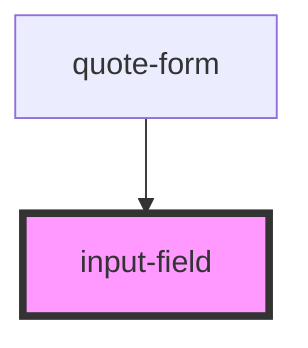

# input-field

<!-- Auto Generated Below -->

## Overview

A reusable input field component supporting input/select/textarea.

Props overview:
- label: Visible label text
- field: 'input' | 'select' | 'textarea' (default 'input')
- type: Input type for <input> (text, email, tel, number, etc.)
- fieldId, name, className, inputClass, labelClass
- value, placeholder, required, disabled, readonly, autocomplete
- pattern, min, max, step, minlength, maxlength
- options: For selects, array of { label, value, disabled? }
- helpText, errorText

Events:
- valueChange: { value, id, name, valid }
- fieldFocus, fieldBlur

## Properties

| Property             | Attribute      | Description | Type                                                      | Default     |
| -------------------- | -------------- | ----------- | --------------------------------------------------------- | ----------- |
| `autocomplete`       | `autocomplete` |             | `string`                                                  | `undefined` |
| `disabled`           | `disabled`     |             | `boolean`                                                 | `false`     |
| `errorText`          | `error-text`   |             | `string`                                                  | `undefined` |
| `field`              | `field`        |             | `"input" \| "select" \| "textarea"`                       | `'input'`   |
| `fieldId`            | `field-id`     |             | `string`                                                  | `undefined` |
| `helpText`           | `help-text`    |             | `string`                                                  | `undefined` |
| `inputClass`         | `input-class`  |             | `string`                                                  | `undefined` |
| `label` _(required)_ | `label`        |             | `string`                                                  | `undefined` |
| `labelClass`         | `label-class`  |             | `string`                                                  | `undefined` |
| `max`                | `max`          |             | `number \| string`                                        | `undefined` |
| `maxlength`          | `maxlength`    |             | `number`                                                  | `undefined` |
| `min`                | `min`          |             | `number \| string`                                        | `undefined` |
| `minlength`          | `minlength`    |             | `number`                                                  | `undefined` |
| `name`               | `name`         |             | `string`                                                  | `undefined` |
| `options`            | --             |             | `{ label: string; value: string; disabled?: boolean; }[]` | `undefined` |
| `pattern`            | `pattern`      |             | `string`                                                  | `undefined` |
| `placeholder`        | `placeholder`  |             | `string`                                                  | `undefined` |
| `readonly`           | `readonly`     |             | `boolean`                                                 | `false`     |
| `required`           | `required`     |             | `boolean`                                                 | `false`     |
| `rootClass`          | `root-class`   |             | `string`                                                  | `undefined` |
| `step`               | `step`         |             | `number \| string`                                        | `undefined` |
| `type`               | `type`         |             | `string`                                                  | `'text'`    |
| `value`              | `value`        |             | `number \| string`                                        | `undefined` |

## Events

| Event         | Description | Type                                                                                    |
| ------------- | ----------- | --------------------------------------------------------------------------------------- |
| `fieldBlur`   |             | `CustomEvent<{ id?: string; name?: string; valid: boolean; }>`                          |
| `fieldFocus`  |             | `CustomEvent<{ id?: string; name?: string; }>`                                          |
| `valueChange` |             | `CustomEvent<{ value: string \| number; id?: string; name?: string; valid: boolean; }>` |

## Dependencies

### Used by

 - [quote-form](../quote-form)

### Graph

----------------------------------------------

*Built with [StencilJS](https://stenciljs.com/)*
