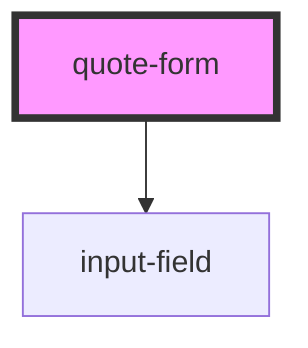

# quote-form

<!-- Auto Generated Below -->

## Overview

QuoteForm Component

## Properties

| Property            | Attribute        | Description | Type                | Default     |
| ------------------- | ---------------- | ----------- | ------------------- | ----------- |
| `consentParagraphs` | --               |             | `string[]`          | `undefined` |
| `formTitle`         | `form-title`     |             | `string`            | `undefined` |
| `intro`             | `intro`          |             | `string`            | `undefined` |
| `phonePattern`      | `phone-pattern`  |             | `string`            | `undefined` |
| `requiredLabel`     | `required-label` |             | `string`            | `undefined` |
| `states`            | --               |             | `StateOptionType[]` | `undefined` |
| `zipPattern`        | `zip-pattern`    |             | `string`            | `undefined` |

## Events

| Event        | Description | Type                                                                                                                                             |
| ------------ | ----------- | ------------------------------------------------------------------------------------------------------------------------------------------------ |
| `formSubmit` |             | `CustomEvent<{ firstName: string; lastName: string; email: string; phone: string; address: string; city: string; zip: string; state: string; }>` |

## Dependencies

### Depends on

- [input-field](../input-field)

### Graph

----------------------------------------------

*Built with [StencilJS](https://stenciljs.com/)*
