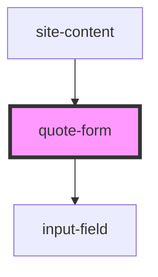

# quote-form

<!-- Auto Generated Below -->

## Overview

Quote Form (assembled using <input-field>)
Emits `formSubmit` with the collected data when valid.

## Events

| Event        | Description | Type                                                                                                                                              |
| ------------ | ----------- | ------------------------------------------------------------------------------------------------------------------------------------------------- |
| `formSubmit` |             | `CustomEvent<{ firstName: string; lastName: string; email?: string; phone: string; address: string; city: string; zip: string; state: string; }>` |

## Dependencies

### Used by

 - [site-content](../content)

### Depends on

- [input-field](../input-field)

### Graph

----------------------------------------------

*Built with [StencilJS](https://stenciljs.com/)*
