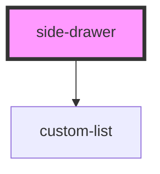

# side-drawer

<!-- Auto Generated Below -->

## Properties

| Property   | Attribute | Description                         | Type                                                                                                                                           | Default                                                                                                                                                                                                                                                                                                                                                                                                                                                                                                                                                                                                                                                                                                                                               |
| ---------- | --------- | ----------------------------------- | ---------------------------------------------------------------------------------------------------------------------------------------------- | ----------------------------------------------------------------------------------------------------------------------------------------------------------------------------------------------------------------------------------------------------------------------------------------------------------------------------------------------------------------------------------------------------------------------------------------------------------------------------------------------------------------------------------------------------------------------------------------------------------------------------------------------------------------------------------------------------------------------------------------------------- |
| `sections` | --        | Accordion sections with list blocks | `{ key: string; label: string; icon?: string; listBlocks: { title: string; items: { label: string; href: string; icon?: string; }[]; }[]; }[]` | `[     {       key: 'insurance',       label: 'Insurance',       listBlocks: [         {           title: 'Vehicle Insurance',           items: [             { label: 'Personal Auto', href: '#auto' },             { label: 'Commercial Auto', href: '#commercial-auto' },             { label: 'Motorcycle', href: '#motorcycle' },             { label: 'Motorhome', href: '#motorhome' },           ],         },       ],     },     {       key: 'claims',       label: 'Claims',       listBlocks: [         {           title: 'File a Claim',           items: [             { label: 'Report a Claim', href: '#report-claim' },             { label: 'Track a Claim', href: '#track-claim' },           ],         },       ],     },   ]` |

## Dependencies

### Depends on

- [custom-list](../custom-list)

### Graph

----------------------------------------------

*Built with [StencilJS](https://stenciljs.com/)*
