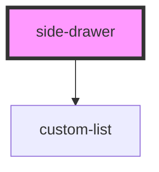

# side-drawer

<!-- Auto Generated Below -->

## Properties

| Property   | Attribute | Description                         | Type                  | Default                |
| ---------- | --------- | ----------------------------------- | --------------------- | ---------------------- |
| `sections` | --        | Accordion sections with list blocks | `SideDrawerSection[]` | `SIDE_DRAWER_SECTIONS` |

## Dependencies

### Depends on

- [custom-list](../custom-list)

### Graph

----------------------------------------------

*Built with [StencilJS](https://stenciljs.com/)*
